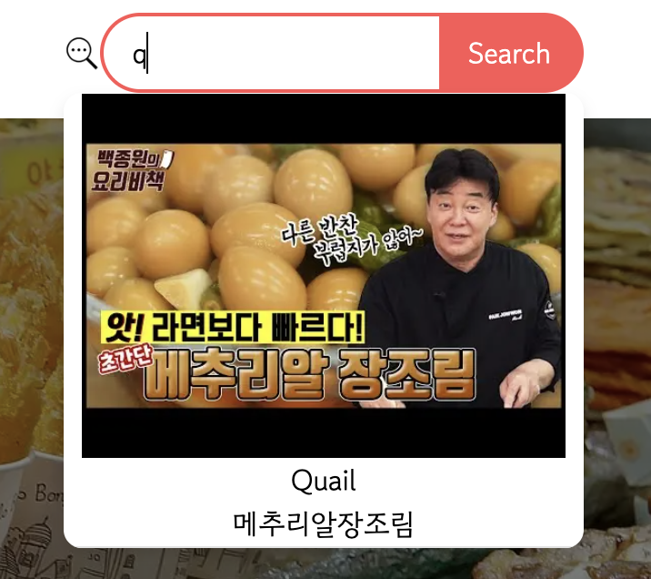

# K-Food 레시피 웹 사이트 v.1
한국에 대한 관심이 증가하고 있는 시대.  
외국에서도 쉽게 한국요리를 접하고 만들 수 있는 웹 사이트 개발합니다.

#### 목표: 읽기 가능한 사이트 개발

## 주의사항 🚨
레시피와 영상의 내용은 같지 않습니다.
정확한 내용은 참고자료 부분을 봐주세요.

## 기술스택
1. React
2. Next js 13
3. CSS 모듈

## 접근방식
접근 방식은 Bottom-Up 방식으로 개발을 진행했습니다.

## 페이지 랜더링
1. SSR
    - 메뉴 리스트 페이지
    - 메인 페이지

2. CSR
    - 검색기능: 실시간 검색(DB에서 실시간으로 값을 업데이트)

3. Modal
    - 상세 내용 모달

## 페이지 설명
#### 1. 메인 페이지

- HeroSection : 자동으로 넘기는 기능 및 인덱스를 설정해서 버튼으로 넘기는 기능

#### 2. 리스트 페이지

- 수평 스크롤 방식
- Intersaction Observer API를 사용해서 카드가 가운데에 위치할 시 강조

#### 3. 상세 내용 모달

- Redux로 모달 상태관리를 진행하여 모든 RecipeCard에 있어서 상세 모달을 볼 수 있도록 함.

#### 4. 검색창

- 실시간으로 검색 결과를 보여줄 수 있도록 함.

### 참고자료
- 만개의 레시피 csv 파일: [링크](https://kadx.co.kr/opmk/frn/pmumkproductDetail/PMU_b72356bd-458a-4734-ba2e-f21de4167b0a/5)
- 각 레시피 별 유튜브 영상

#### 개발과정
```
1. csv 파일을 받아서, 각 레시피의 제목 별로 YouTube API를 사용해 youtubeId를 가져옴.
2. csv 파일을 Google Cloud Translation API 사용해서 번역.
3. 최종 csv 파일을 사용하여 웹 개발
```

## 앞으로의 개발 방향
- 일반적으로 유저들이 사용할 수 있도록 하는 웹 페이지 개발(CRUD가 가능한)